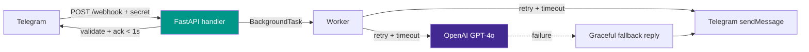

<div align="center">

# Telegram AI Assistant — Webhook + OpenAI

**Event-driven Python service: Telegram webhook → FastAPI → OpenAI (GPT-4o), with bounded timeouts, retry/backoff, secret validation and a typed test suite.**

[](https://github.com/franamaro-dev/Telegram-AI-Bot/actions)
[](https://www.python.org/)
[](https://fastapi.tiangolo.com/)
[]()
[]()
[](LICENSE)

</div>

> Personal project, engineered to production standards. It is the reference
> setup I use for putting an LLM behind a webhook without the HTTP path
> ever blocking on the model.

---

## What it solves

A naive Telegram + LLM bot has three failure modes:

1. The webhook blocks on the LLM and Telegram times out → duplicate deliveries.
2. A transient OpenAI hiccup drops the user's message silently.
3. Anyone who finds the public URL can drive your OpenAI bill.

This service addresses all three by design.

---

## Architecture



1. **Ack fast**: the handler validates the update and returns `200` in
   well under Telegram's webhook timeout. The LLM call is offloaded to a
   FastAPI `BackgroundTask`, so a slow model never causes a Telegram retry.
2. **Resilient LLM call**: `tenacity` exponential backoff on *transient*
   OpenAI errors (timeout, connection, rate-limit). Permanent errors
   (auth, bad request) fail fast — no pointless retries.
3. **Fail closed, degrade gracefully**: if the LLM is unreachable after
   retries the user gets an explicit fallback message, never silence.
4. **Authenticated webhook**: validates Telegram's
   `X-Telegram-Bot-Api-Secret-Token` header when a secret is configured.
5. **Strict input validation**: every update parsed through Pydantic
   models; unknown shapes are acknowledged and ignored, not crashed on.

---

## Engineering highlights

| Concern | Implementation |
|---------|----------------|
| Non-blocking HTTP path | `BackgroundTasks` — ack before LLM call |
| Transient-failure resilience | `tenacity` exponential backoff, bounded attempts |
| Timeouts | Explicit timeouts on OpenAI **and** outbound Telegram calls |
| Permanent vs transient | 4xx/auth fail fast; 5xx/network retried |
| Webhook auth | Shared-secret header check |
| Input validation | Pydantic `TelegramUpdate` schema |
| Config & secrets | `pydantic-settings`, env-only, no creds in source |
| Observability | Structured logging with levels |
| Container hardening | Non-root user, `HEALTHCHECK`, layered cache |
| Tests | 13 tests, 87% coverage, OpenAI + httpx mocked |

---

## Run

```bash
export TELEGRAM_BOT_TOKEN="..."
export OPENAI_API_KEY="sk-..."
export TELEGRAM_WEBHOOK_SECRET="$(openssl rand -hex 16)"   # optional but recommended

docker build -t telegram-ai-bot .
docker run -p 127.0.0.1:8000:8000 \
  -e TELEGRAM_BOT_TOKEN -e OPENAI_API_KEY -e TELEGRAM_WEBHOOK_SECRET \
  telegram-ai-bot
```

Register the webhook (pass the same secret to Telegram):

```bash
python set_webhook.py
```

Health check: `GET /health` → `{"status":"ok","configured":true}`.

> Bind to loopback and put it behind a reverse proxy (nginx/Traefik)
> with HTTPS in production — never expose the app port directly.

---

## Tests

```bash
pip install -r requirements-dev.txt
pytest --cov=bot
```

Covers: fast-ack flow, schema rejection, webhook-secret enforcement,
OpenAI retry-then-succeed, retry exhaustion → typed error, empty
completion handling, Telegram 4xx vs 5xx behaviour.

---

## Tech stack

Python 3.11+ · FastAPI · OpenAI SDK (async) · httpx · tenacity ·
pydantic-settings · pytest / pytest-asyncio · Docker

---

## License

[MIT](LICENSE) © Francisco Amaro Prieto

---

<div align="center">

Built by [Francisco Amaro](https://github.com/franamaro-dev) — Backend Engineer & SOC L1 Analyst
[LinkedIn](https://linkedin.com/in/franamaro) · [Email](mailto:franamaroprieto@gmail.com)

</div>
